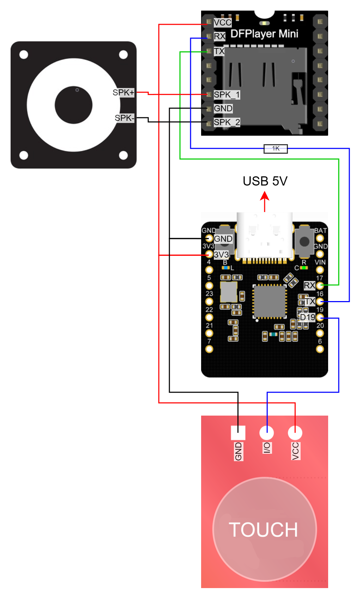
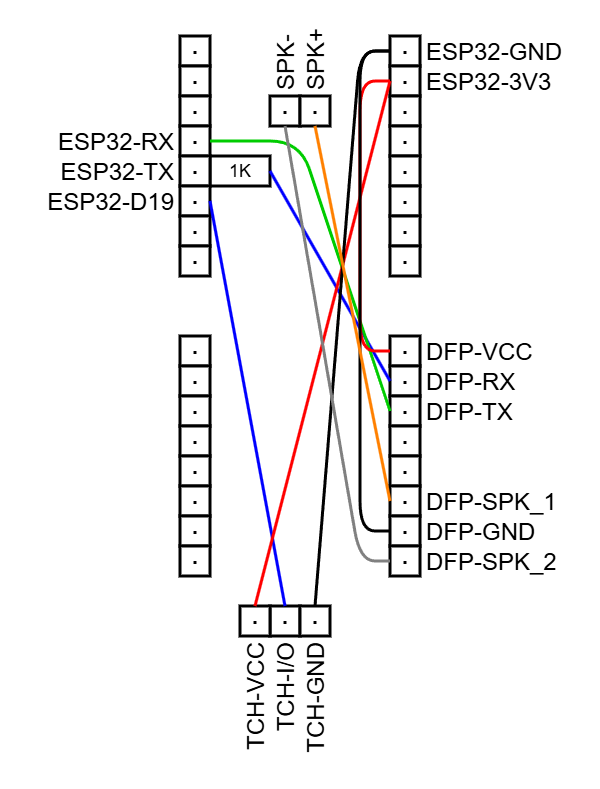
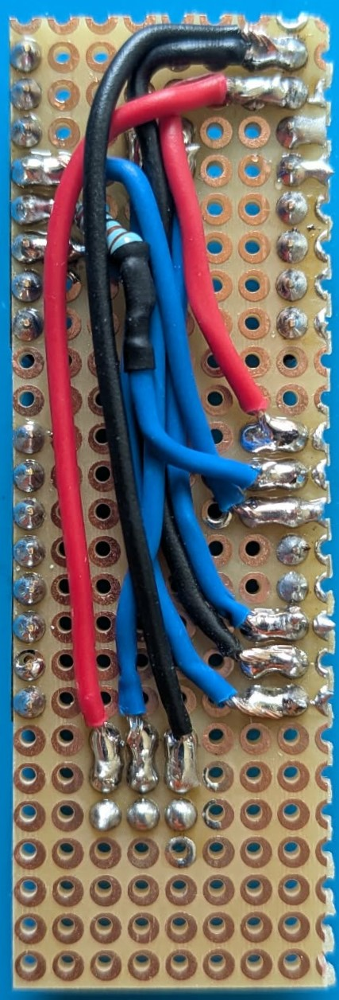
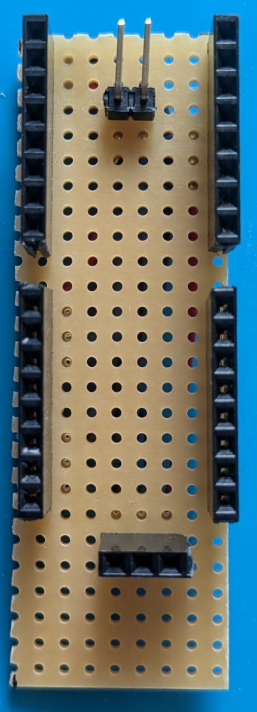
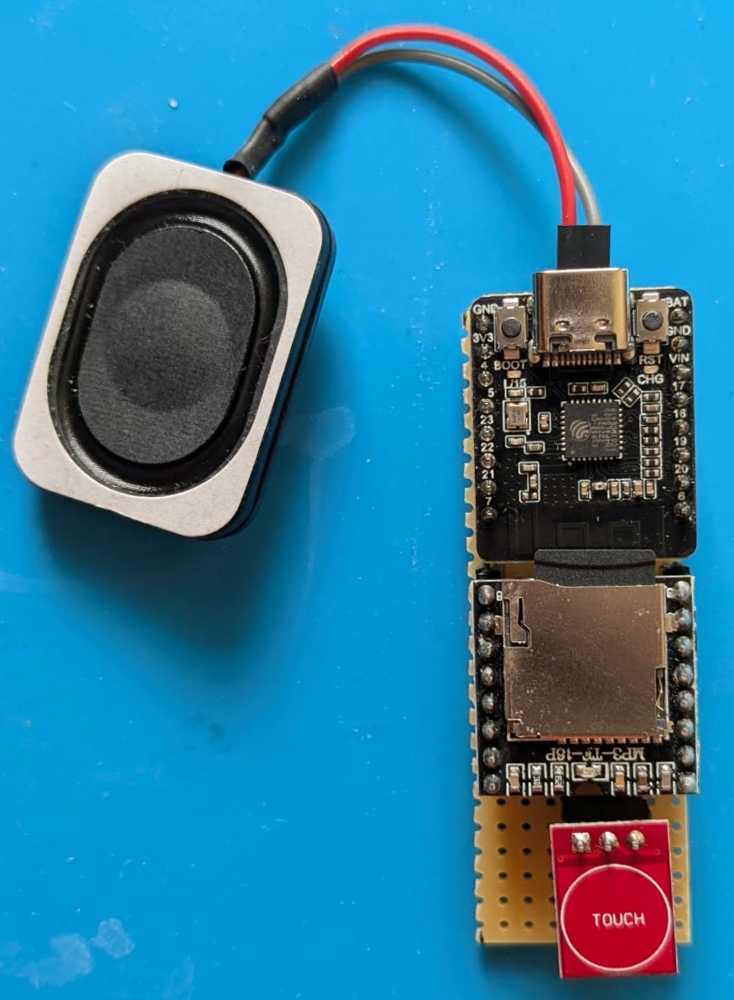

# Finger Reading Oracle Machine

|  |
| :-: |
| Connection diagram |

|  |
| :-: |
| Wiring diagram |

|  |  |  |
| --- | :-: | --- |
| | Assembled board | |

| Component | Store URL |
| --- | --- |
| DFRobot Beetle ESP32-C6 Mini | Cell2 |
| TTP223B-TM Capacitive Touch Sensor | [https://www.hestore.hu/prod_10037912.html](https://www.hestore.hu/prod_10037912.html) |
| DFRobot DFPlayer Mini | [https://www.hestore.hu/prod_10038040.html](https://www.hestore.hu/prod_10038040.html) |
| 4 Ohm 3W Speaker | [https://www.hestore.hu/prod_10049293.html](https://www.hestore.hu/prod_10049293.html) |

**TTS to MP3 tool:** [https://apps.microsoft.com/detail/9n92n3shd1mv](https://apps.microsoft.com/detail/9n92n3shd1mv)

**MP3 editor tool:** [https://www.dvdvideosoft.com/products/dvd/Free-Audio-Editor.htm](https://www.dvdvideosoft.com/products/dvd/Free-Audio-Editor.htm)
