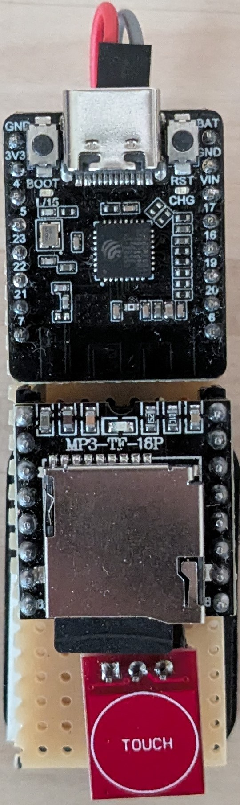
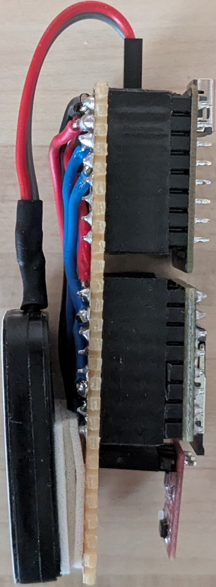
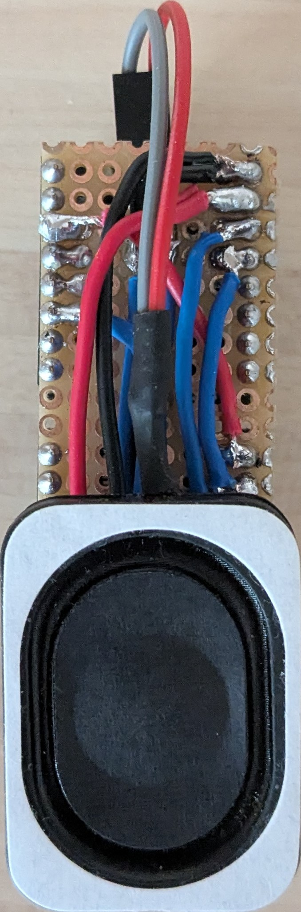

# Finger Reading Oracle Machine <!-- omit from toc -->

Fingerprint reading oracle machine for the 62nd TORTÚRA "ORÁKULUM" task

1. [Connections](#connections)
2. [Mechanical assembly](#mechanical-assembly)
3. [Sources](#sources)

## Connections

|  |
| :-: |
| Connection diagram |

## Mechanical assembly

|  |  |  |
| --- | :-: | --- |
| | Assembled board | |

## Sources

| Component | URL |
| --- | --- |
| DFRobot Beetle ESP32-C6 Mini | [https://www.dfrobot.com/product-2778.html](https://www.dfrobot.com/product-2778.html) |
| TTP223B-TM Capacitive Touch Sensor | [https://www.hestore.hu/prod_10037912.html](https://www.hestore.hu/prod_10037912.html) |
| DFRobot DFPlayer Mini | [https://www.hestore.hu/prod_10038040.html](https://www.hestore.hu/prod_10038040.html) |
| 4 Ohm 3W Speaker | [https://www.hestore.hu/prod_10049293.html](https://www.hestore.hu/prod_10049293.html) |
| TTS to MP3 tool | [https://speechgen.io/](https://speechgen.io/) |
| MP3 editor tool | [https://audiomass.co/](https://audiomass.co/) |
| DFPlayer Arduino library | [https://github.com/DFRobot/DFRobotDFPlayerMini](https://github.com/DFRobot/DFRobotDFPlayerMini) |
